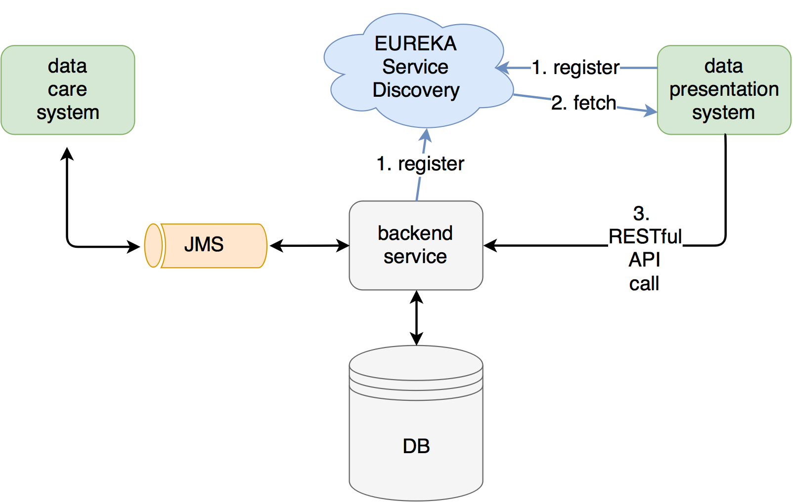

# spring-boot-docker-rabbitmq-sample

- RabbitMQ
- Spring Boot Apps
- Spring Cloud - Eureka
- Spring Boot Admin by codecentric
- Docker compose




## RabbitMQ
for Management Console

default user: guest

default password: guest

## build 
```bash
mvn clean install
```
in this step, also the docker images will be created (see docker-maven-plugin)

## run with docker-compose
### run...
```bash
docker-compose up -d
```
Queue System [http://localhost:15672/](http://localhost:15672/)

Eureka Server [http://localhost:8761/](http://localhost:8761/)

Backend [http://localhost:8081/api/product/list](http://localhost:8081/api/product/list)

Care [http://localhost:8082/product](http://localhost:8082/product)

Presentation [http://localhost:8084/](http://localhost:8084/)

Spring Boot Admin [http://localhost:8083/](http://localhost:8083/)

### stop!
```bash
docker-compose stop
```
### cleanup
```bash
docker-compose rm
```
### check
```bash
docker-compose ps
```
